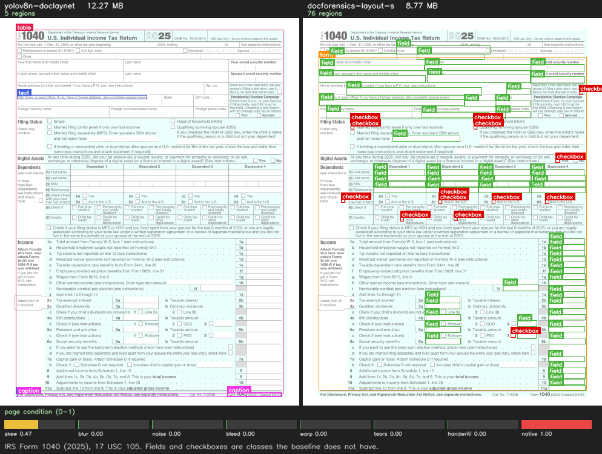
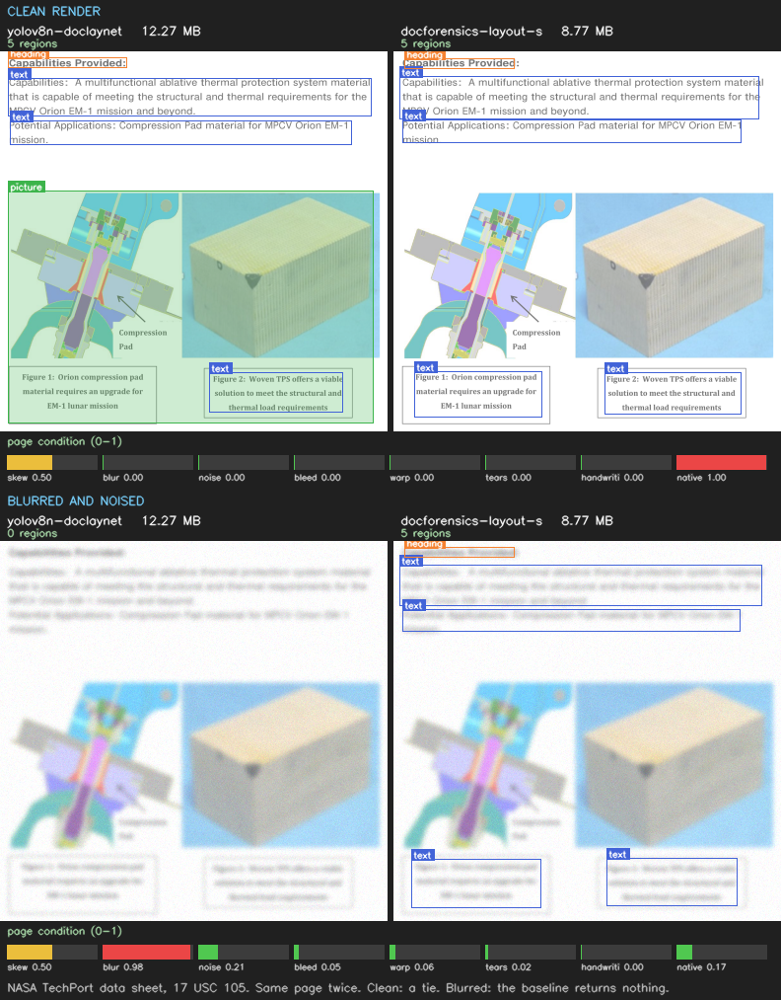
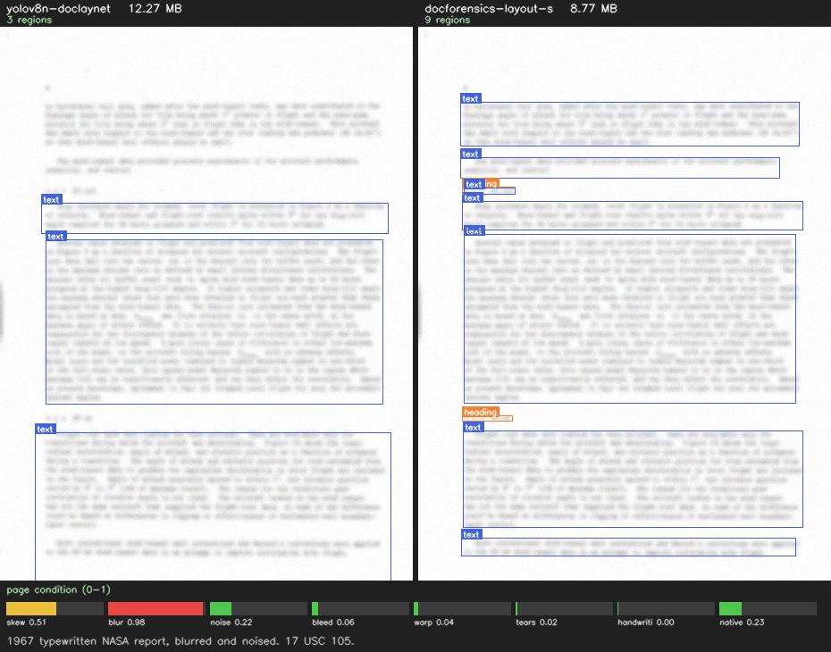
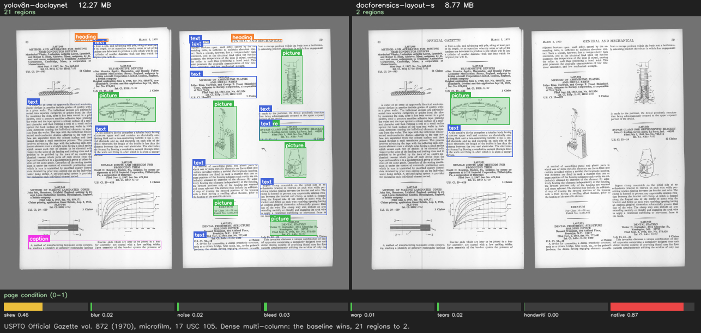

# Examples

Four pages, run through both models, no cherry-picking of the boxes. Two of
them the model wins, one is a tie, one it loses. The losing one is here on
purpose: a page of examples where everything works tells you nothing about
where the thing breaks.

Every panel is 640 px, which is what the model actually sees. Left is the
baseline, right is this model, and the strip underneath is the forensic head —
eight page-condition estimates that the baseline does not produce at all.

---

### Form fields and checkboxes



**5 regions against 76.** `field` and `checkbox` are not classes the baseline
has, so on a form it can only report that a form exists. This is the clearest
gap between the two, and it is a difference in ontology rather than accuracy.

### The same page, clean and degraded



Clean, it is a tie at 5 regions each — and the baseline gets the figure block
that this model misses. Blurred and noised, **the baseline returns nothing**
and this model still returns 5. Across 120 held-out degraded pages the baseline
returned no regions at all on 14 of them.

Watch the condition strip between the rows: `blur` goes 0.00 → 0.98 and
`native` goes 1.00 → 0.17. That is the model telling you the page is a
degraded raster before you decide whether to trust the boxes.

### Typewritten, 1967



**3 regions against 9.** Both models find text; only one separates the
paragraphs, which is the difference between an extractor getting five blocks
and getting one.

### Where it loses



**21 regions against 2.** Dense multi-column microfilm is the worst case for
this model, and the README says so. If your pages look like this, use the
baseline.

---

## Provenance

Every page is a **United States federal work** under 17 USC 105. There is no
copyright in any of them, so there is nothing to attribute and nothing for you
to comply with when you copy this repository.

| image | source | where it came from |
|---|---|---|
| 01 | IRS Form 1040 (2025) | https://www.irs.gov/pub/irs-pdf/f1040.pdf |
| 02 | NASA NTRS 20140016745 | https://ntrs.nasa.gov/citations/20140016745 |
| 03 | NASA NTRS 19670020207 | https://ntrs.nasa.gov/citations/19670020207 |
| 04 | USPTO Official Gazette vol. 872 (1970) | https://archive.org/details/officialgazette872unit |

The NASA items were selected by the API's own `copyright.determinationType`
field reading `GOV_PUBLIC_USE_PERMITTED`, with no third-party material flagged.
The gazette was digitised by the Internet Archive itself, which its item
metadata records as `contributor: Internet Archive`.

The degradation in images 02 and 03 is synthetic, applied by this project to
those same federal pages. Nothing here is a third-party scan whose reproduction
rights are asserted rather than checked.

## Reproducing them

The figures are generated, not hand-assembled:

```bash
./training/.venv/bin/python training/scripts/make_examples.py \
    --src <directory of the source PDFs> --out publish/github/examples/images
```

## Running it yourself

`browser.html` is the same model in a page, and `detect.py` is the same model
in twenty lines of Python. Both are in this directory.
